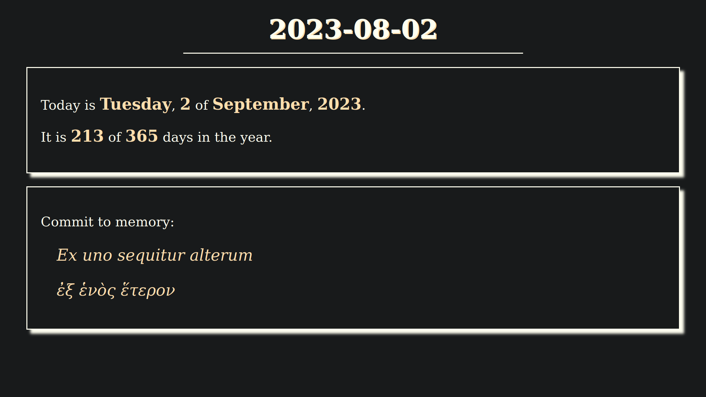

# daily-document

*daily-document* is a small web application in the form of dynamic webpage,
containing information about current date.

Additionally it displays data to remember/memorize, supplied from a json file.

## Demo

[daily-document.html at github pages](https://heliotech.github.io/daily-document.html)

## Instrukcje instalacji

1. Clone repository and open index.html in the browser.
2. Edit memory.json data file; format:
	const memorylane = {
	    "1": {"item": "what",
	          "def": "description"},
	    "2": {"item": "what",
	          "def": "description"}
	}

## Technologies

- HTML & CSS
- javascript
- external data, json file, loaded and parsed into HTML

## Screenshots

## Author

Sebastian M. Kazimierski

## Licence

This project is licensed under the [MIT License](https://opensource.org/licenses/MIT).

## Repository

## Contact

E-mail: pykhaz@o2.pl
